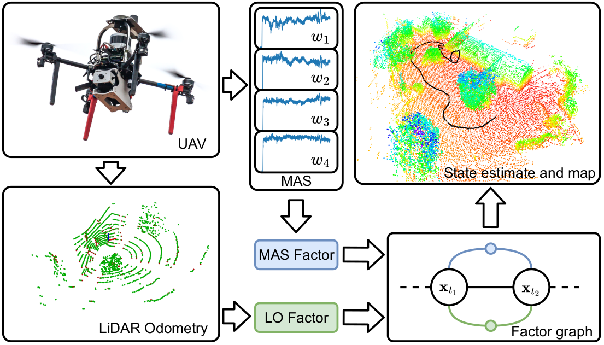

# Motor Angular Speeds - Lidar Odometry (MAS-LO)

This repository contains the public open-source implementation of the MAS-LO algorithm proposed in our T-RO publication [1].
The implementation is developed for ROS1 Noetic and Ubuntu 20.04.
If you use our work please cite the publication.



## Publication

- [1] Petrlik, M.; Penicka, R.; Saska, M. *Motor Angular Speed Preintegration for Multirotor UAV State Estimation*, IEEE Transactions on Robotics (in review), 2024
```bibtex
@article{petrlik2024maslo,
  author={M. Petrlik and Penicka, Robert and Saska, Martin}, 
  journal={IEEE Transactions on Robotics}, 
  title={{Motor Angular Speed Preintegration for Multirotor UAV State Estimation}}, 
  year={2024},
  annotation = {in review}
}
```
 
## MAS-based State Estimation

The Motor Angular Speed (MAS) measurements of all motors are propagated through the UAV propulsion model, which converts MAS measurements of individual motors into linear and angular accelerations of the Center of Gravity (CoG) of the UAV where the Flight Control Unit (FCU) is ideally located. 
The propulsion model depends on the number of rotors, their position relative to the CoG, and spin direction. 
The model converts MAS measurements into forces and torques acting on the CoG using the thrust and torque coefficients.
With known UAV mass and inertial matrix, the resultant force and torque are converted into linear and angular accelerations, respectively.

Using the raw accelerations directly in the graph optimization would be too computationally demanding, as they are obtained at the same rate as the Electronic Speed Controllers (ESCs) report Revolutions per Minute (RPM) of the motors, which is a few hundred times per second.
To allow lower-rate on-demand fusion of the obtained accelerations while preserving all available information, we employ preintegration of the MAS measurements to obtain delta values of the UAV state.

When a pose measurement from a localization method is available, it is converted into a prior factor that constrains the position and orientation state variables. 
At the same time, the preintegrated MAS is converted into the MAS factor that constrains the relative change of the whole state vector.
To compensate for drift accumulated during the preintegration, compensate the non-zero transformation between the center of the UAV and the CoG, and to accommodate unmodeled aerodynamic effects, we add a linear and angular acceleration bias factor that integrates all of these errors into a single term.

## Example 

For running an example on our public [datasets](https://github.com/ctu-mrs/mas_datasets) follow these steps:

1. Clone this repository and the [datasets](https://github.com/ctu-mrs/mas_datasets) into your ROS1 workspace and build the workspace:
```bash
roscd && cd ../src/
git clone https://github.com/ctu-mrs/mas_datasets
git clone https://github.com/ctu-mrs/maslo
catkin build && roscd && source ./setup.sh
```
2. Download the datasets:
```bash
roscd mas_datasets && ./download_processed.sh
```
3. Run the example:
```bash
roscd maslo && ./example/start.sh
```

## Acknowledgements

- Based on [LIO-SAM](https://github.com/TixiaoShan/LIO-SAM/tree/master) by Tixiao Shan. 
```bibtex
@inproceedings{liosam2020shan,
  title={LIO-SAM: Tightly-coupled Lidar Inertial Odometry via Smoothing and Mapping},
  author={Shan, Tixiao and Englot, Brendan and Meyers, Drew and Wang, Wei and Ratti, Carlo and Rus Daniela},
  booktitle={IEEE/RSJ International Conference on Intelligent Robots and Systems (IROS)},
  pages={5135-5142},
  year={2020},
  organization={IEEE}
}
```
- Factor graph optimization built in the [GTSAM]{https://github.com/borglab/gtsam} framework
```bibtex
@software{gtsam,
  author       = {Frank Dellaert and GTSAM Contributors},
  title        = {borglab/gtsam},
  month        = May,
  year         = 2022,
  publisher    = {Georgia Tech Borg Lab},
  version      = {4.2a8},
  doi          = {10.5281/zenodo.5794541},
  url          = {https://github.com/borglab/gtsam)}}
}
```


